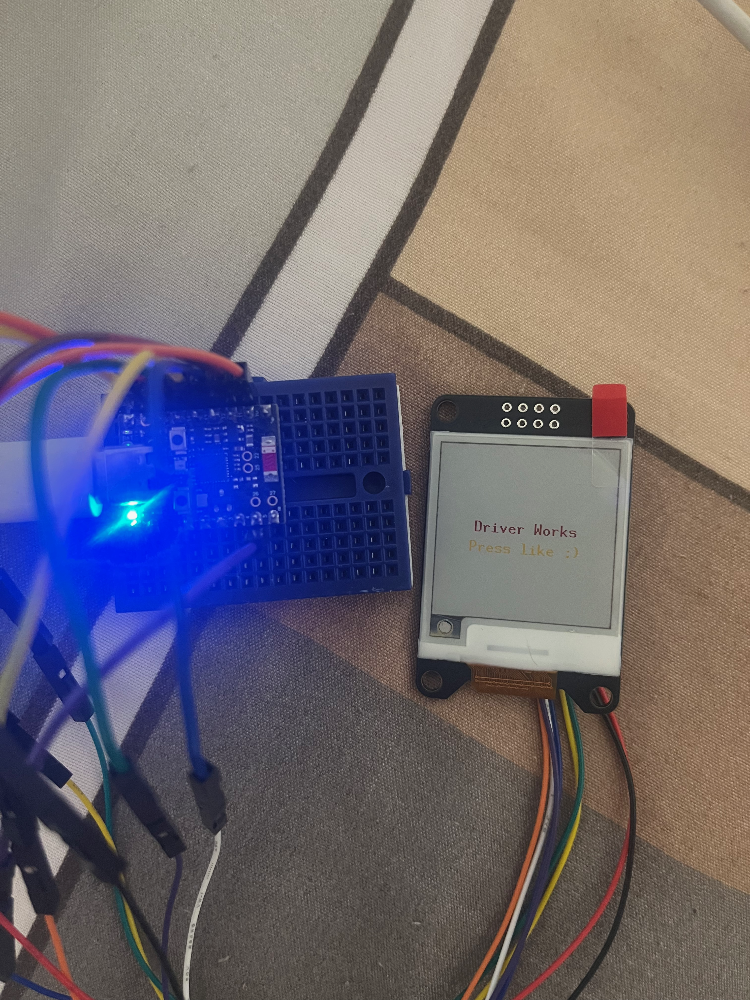

# weact-epaper-154-rs



An experimental Rust driver for a 1.54-inch, 200 x 200, four-color
(black, white, red, and yellow) e-paper display. The crate is built on
[`embedded-hal` 1.0](https://docs.rs/embedded-hal/1.0) and implements the
[`embedded-graphics-core`](https://docs.rs/embedded-graphics-core/0.4)
`DrawTarget` interface.

> [!WARNING]
> This driver is under development and has not yet been declared production
> ready. The initialization sequence currently targets the JD79660-style
> four-color panel. Verify the controller and FPC marking of your display
> before using it: visually similar 1.54-inch modules may use a different
> controller and require a different command sequence.

## Features

- 200 x 200 pixel framebuffer
- Four colors with two bits per pixel
- `embedded-hal` SPI, GPIO, and delay abstractions
- `embedded-graphics-core::DrawTarget` implementation
- Hardware reset, initialization, power control, and full-screen refresh
- Separate SPI, DC, BUSY, and RESET error reporting

The framebuffer occupies 10,000 bytes of RAM.

## Hardware interface

The driver requires the following resources:

| Signal | Direction | Purpose |
| --- | --- | --- |
| SPI | Output | Commands and framebuffer data |
| DC | Output | Selects command or data mode |
| BUSY | Input | Indicates that the display controller is busy |
| RESET | Output | Resets the display controller |
| DELAY | N/A | Provides reset and polling delays |

Chip select is expected to be managed by the `SpiDevice` implementation.

## Installation

Until the crate is published, add it as a local dependency:

```toml
[dependencies]
weact-epaper-154-rs = { path = "../weact-epaper-154-rs" }
```

Applications that draw shapes or text will normally also depend on
`embedded-graphics`:

```toml
[dependencies]
embedded-graphics = "0.8"
```

## Usage

Construct the platform-specific `SpiDevice`, GPIO pins, and delay provider,
then pass ownership of them to the display:

```rust,ignore
use weact_epaper_154_rs::{
    color::WBRYColor,
    driver::WeAct154Display,
};

// These values are provided by your MCU's HAL.
let spi_device = /* configured embedded_hal::spi::SpiDevice */;
let dc = /* configured output pin */;
let busy = /* configured input pin */;
let delay = /* embedded_hal::delay::DelayNs implementation */;
let reset = /* configured output pin */;

let mut display = WeAct154Display::new(
    spi_device,
    dc,
    busy,
    delay,
    reset,
);

display.reset()?;
display.init()?;
display.power_on()?;

display.set_pixel(10, 20, WBRYColor::BLACK);
display.set_pixel(11, 20, WBRYColor::RED);
display.set_pixel(12, 20, WBRYColor::YELLOW);

// Drawing changes only the local framebuffer. Call flush() to refresh the
// physical panel.
display.flush()?;
display.power_off()?;

# Ok::<(), core::convert::Infallible>(())
```

The normal startup sequence is:

```text
new -> reset -> init -> power_on -> draw -> flush -> power_off
```

`flush()` performs a full display update. E-paper refreshes are much slower
than LCD updates, so draw the complete frame first and refresh only when
needed.

## Using embedded-graphics

`WeAct154Display` implements `DrawTarget`, so it can be used with
`embedded-graphics` primitives and text renderers:

```rust,ignore
use embedded_graphics::{
    prelude::*,
    primitives::{PrimitiveStyle, Rectangle},
};
use weact_epaper_154_rs::color::WBRYColor;

Rectangle::new(Point::new(8, 8), Size::new(64, 32))
    .into_styled(PrimitiveStyle::with_fill(WBRYColor::RED))
    .draw(&mut display)?;

display.flush()?;
```

Pixels outside the display bounds are ignored.

## Direct framebuffer access

Advanced users can modify the packed framebuffer directly:

```rust,ignore
let framebuffer: &mut [u8] = display.frame_buffer_mut();
```

Each byte contains four pixels, with two bits per pixel. Prefer `set_pixel`
or the `DrawTarget` implementation unless the panel's packed pixel format is
required explicitly.

## Error handling

Driver operations return `DriverError`, which distinguishes errors produced
by SPI, DC, BUSY, and RESET:

```rust,ignore
use weact_epaper_154_rs::driver::DriverError;

match display.flush() {
    Ok(()) => {}
    Err(DriverError::Spi(error)) => { /* handle SPI error */ }
    Err(DriverError::DcPin(error)) => { /* handle DC error */ }
    Err(DriverError::BusyPin(error)) => { /* handle BUSY error */ }
    Err(DriverError::ResetPin(error)) => { /* handle RESET error */ }
}
```

## Current limitations

- Only full-screen updates are exposed.
- Waiting for BUSY currently has no timeout.
- The driver has not yet been tested across multiple controller revisions.
- Automated tests and a hardware-tested example application are still
  needed.
- Deep sleep and partial refresh are not implemented.

## Roadmap

### 1. Stabilize the current implementation

- [x] Run `rustfmt` over the crate and the ESP32-H2 example.
- [x] Use appropriate unsigned types for dimensions and framebuffer indexes.
- [x] Fix the coordinate bounds check so `x` is checked against `WIDTH` and `y` against `HEIGHT`.
- [x] Add `clear(color)`, immutable `frame_buffer()`, and consider a `release()` method that returns the owned peripherals.
- [x] Document the controller commands and the source of the initialization sequence values.

### 2. Add automated tests without hardware

- [ ] Add mock SPI, GPIO, and delay implementations.
- [ ] Test packing four two-bit pixels into each framebuffer byte.
- [ ] Test all four colors, boundary coordinates, and out-of-bounds pixels.
- [ ] Test that a newly created framebuffer is white (`0x55`).
- [ ] Verify the command sequences for reset, initialization, power control, and refresh.
- [ ] Verify DC switching between commands and data.
- [ ] Test propagation of SPI, DC, BUSY, and RESET errors.
- [ ] Test BUSY polling behavior.


### 3. Prevent hangs and improve the lifecycle API

- [ ] Add a configurable timeout to BUSY polling.
- [ ] Add a timeout variant to `DriverError`.

### 4. Validate on real hardware

- [ ] Add a diagnostic firmware example for all four solid colors.
- [ ] Test corner pixels, a border, rows, columns, and a checkerboard pattern.
- [ ] Test text and primitives rendered through `embedded-graphics`.
- [ ] Test repeated reset, refresh, and power-off cycles.
- [ ] Test refreshing after a prolonged sleep.

### 5. Improve power usage and performance

- [ ] Implement deep sleep and a verified wake-up sequence.
- [ ] Add display rotation if it is useful beyond the transforms already available in the graphics ecosystem.
- [ ] Investigate partial refresh only after confirming that the exact panel controller supports it and documenting its LUT and color limitations.

### 6. Prepare a release

- [ ] Select and add a license.
- [ ] Add crate metadata such as description, repository, license, keywords, categories, and readme.
- [ ] Add CI checks for formatting, Clippy, tests, and `no_std` compilation.
- [ ] Build the ESP32-H2 example in a separate CI job.
- [ ] Add a changelog and define the minimum supported Rust version.
- [ ] Document wiring and known-compatible panel revisions.

## Development

Run the standard checks with:

```sh
cargo fmt --all -- --check
cargo clippy --all-targets -- -D warnings
cargo test --all-targets
```

Hardware validation should include all four solid colors, corner pixels,
rows and columns, error propagation, repeated resets, and repeated
power-on/refresh/power-off cycles.

## License

No license has been selected yet. Add a license before distributing or
publishing the crate.
